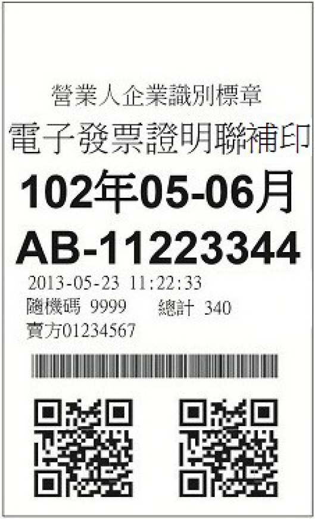

# 電子發票 券面意義解釋

兩碼英文 + 八碼數字編號 : DV66841990

QRcode 電子發票，有三個條碼圖，依相對位置分別為：
1. 上方：一維條碼，提供兌領獎時輸入使用
2. 左方：含發票字軌號碼、發票開立日期 (年月日)、4碼隨機碼、銷售額、總計額、買方 統一編號、賣方統一編號、加密驗證資訊、營業人自行使用區、二維條碼記載完整品目筆數、該張發票交易品目總筆數、中文編碼參數、品名、數量、單價、補充說明
3. 右方：接續左方二維條碼不敷記載之中文編碼後資訊





### 上方條碼記載範例：
```
10908DV668419907406
```
- 發票年期別 (5): 10908 
- 發票字軌號碼 (10): DV66841990
- 隨機碼 (4): 7406


### 左方條碼記載範例：
```
DV6684199010907267406000000000000003a0000000028978541mW7KTv1v1iT5 6lr3IFCOBg==:**********:1:1:1:      
```
- 發票字軌號碼 (10)
- 發票開立日期 (7): 3碼民國年份2碼月份2碼日期共7碼
- 隨機碼 (4)
- 銷售額 (8): 將金額轉換以十六進位方式記載
- 總計額 (8): 將金額轉換以十六進位方式記載
- 買方統一編號 (8)
- 賣方統一編號 (8)
- 加密驗證資訊 (24): 發票字軌號碼10碼及隨機碼4碼以字串方式合併後使用 AES 加密並採用 Base64 編碼轉換
- 以上欄位總計 77 碼


### 右方條碼請參考文件

[電子發票證明聯一維及二維條碼規格說明](https://www.einvoice.nat.gov.tw/home/DownLoad?fileName=1575448081679_0.pdf)
